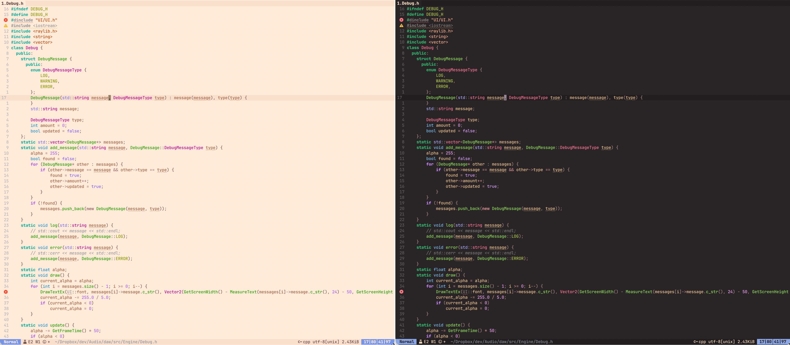

# bonbon.nvim

A colorful but soothing theme for neovim.

## Screenshots



## Installation

Install using vimpack `vim.pack.add({"https://github.com/pankvitek/bonbon.nvim"})`.

## Usage

To set your theme, put `require('bonbon').colorscheme()` in your config (or `colorscheme bonbon` in cmdline).

To change from dark theme to light theme, use `vim.opt.background = 'light'` or `'dark'` in your config.

## Mappings

I suggest the mapping to switch light and dark theme.

```lua
map("n", "<leader>v", function()
    if vim.o.background == "light" then
        vim.o.background = "dark"
    else
        vim.o.background = "light"
    end
end, { noremap = true, silent = true })
```
